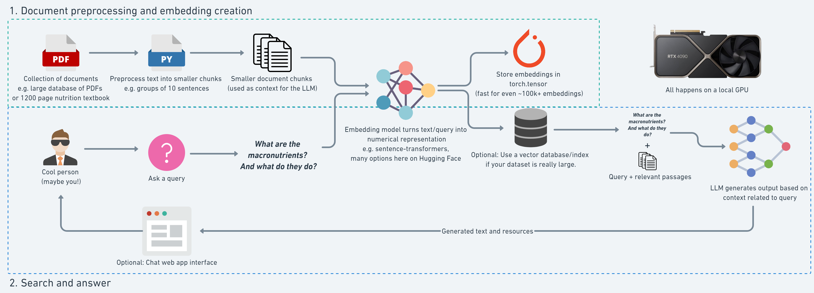
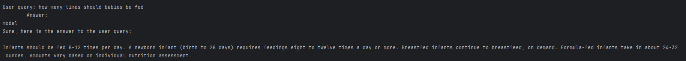

# Rag-Model-Implementaton
A basic rag model implementation example, I hope this will be easy to understand and implement. 
Good Luck !!

Paper: Retrieval-Augmented Generation for Knowledge-Intensive NLP Tasks https://arxiv.org/pdf/2005.11401

This model uses google/gemma-7b-it. This model card corresponds to the 7B instruct version of the Gemma model."
Gemma documentation: https://huggingface.co/google/gemma-7b-it

## Objective 
The goal of this project is to build a RAG Model (Retrieval Augmented Generation) pipeline from scratch and have it run on a local GPU,  
we'd like to be able to open a PDF file, ask questions (queries) of it and have them answered by a Large Language Model (LLM).

There are frameworks that replicate this kind of workflow, including LlamaIndex and LangChain, however, the goal of building from scratch is to be able to inspect and customize all the parts.

**What is RAG?**

RAG stands for Retrieval Augmented Generation.
It was introduced in the paper Retrieval-Augmented Generation for Knowledge-Intensive NLP Tasks.

    Each step can be roughly broken down to:

    Retrieval - Seeking relevant information from a source given a query. For example, getting relevant passages of Wikipedia text from a database given a question.
    Augmented - Using the relevant retrieved information to modify an input to a generative model (e.g. an LLM).
    Generation - Generating an output given an input. For example, in the case of an LLM, generating a passage of text given an input prompt.

Why RAG?
The main goal of RAG is to improve the generation outptus of LLMs.

    Two primary improvements can be seen as:
    
    1)  Preventing hallucinations - LLMs are incredible but they are prone to potential hallucination, as in, 
        generating something that looks correct but isn't. RAG pipelines can help LLMs generate more factual outputs 
        by providing them with factual (retrieved) inputs. And even if the generated answer from a RAG pipeline 
        doesn't seem correct, because of retrieval, you also have access to the sources where it came from.

    
    2)  Work with custom data - Many base LLMs are trained with internet-scale text data. 
        This means they have a great ability to model language, however, they often lack specific knowledge. 
        RAG systems can provide LLMs with domain-specific data such as medical information or company documentation 
        and thus customized their outputs to suit specific use cases.

What kind of problems can RAG be used for?
    RAG can help anywhere there is a specific set of information that an LLM may not have in its training data (e.g. anything not publicly accessible on the internet).
    
    For example you could use RAG for:

    Customer support Q&A chat - By treating your existing customer support documentation as a resource, when a customer asks a question, you could have a system retrieve relevant documentation snippets and then have an LLM craft those snippets into an answer. Think of this as a "chatbot for your documentation". Klarna, a large financial company, uses a system like this to save $40M per year on customer support costs.
    Email chain analysis - Let's say you're an insurance company with long threads of emails between customers and insurance agents. Instead of searching through each individual email, you could retrieve relevant passages and have an LLM create strucutred outputs of insurance claims.
    Company internal documentation chat - If you've worked at a large company, you know how hard it can be to get an answer sometimes. Why not let a RAG system index your company information and have an LLM answer questions you may have? The benefit of RAG is that you will have references to resources to learn more if the LLM answer doesn't suffice.
    Textbook Q&A - Let's say you're studying for your exams and constantly flicking through a large textbook looking for answers to your quesitons. RAG can help provide answers as well as references to learn more.
    All of these have the common theme of retrieving relevant resources and then presenting them in an understandable way using an LLM.

Key Terms:

    Token - A sub-word piece of text. For example, "hello, world!" could be split into ["hello", ",", "world", "!"]. A token can be a whole word,
            part of a word or group of punctuation characters. 1 token ~= 4 characters in English, 100 tokens ~= 75 words.
            Text gets broken into tokens before being passed to an LLM.
    
    Embedding - A learned numerical representation of a piece of data. For example, a sentence of text could be represented by a vector with
            768 values. Similar pieces of text (in meaning) will ideally have similar values.
    
    Embedding model	- A model designed to accept input data and output a numerical representation. For example, a text embedding model may take in 384
            tokens of text and turn it into a vector of size 768. An embedding model can and often is different to an LLM model.
    
    Similarity search/vector search - Similarity search/vector search aims to find two vectors which are close together in high-demensional space. For example,
            two pieces of similar text passed through an embedding model should have a high similarity score, whereas two pieces of text about
            different topics will have a lower similarity score. Common similarity score measures are dot product and cosine similarity.
    
    Large Language Model (LLM) - A model which has been trained to numerically represent the patterns in text. 
            A generative LLM will continue a sequence when given a sequence. For example, given a sequence of the text 
            "hello, world!", a genertive LLM may produce "we're going to build a RAG pipeline today!".
            This generation will be highly dependant on the training data and prompt.

    LLM context window - The number of tokens a LLM can accept as input. For example, as of March 2024, GPT-4 has a default context window of 32k tokens
            (about 96 pages of text) but can go up to 128k if needed. A recent open-source LLM from Google, Gemma (March 2024) has a context
            window of 8,192 tokens (about 24 pages of text). A higher context window means an LLM can accept more relevant information
            to assist with a query. For example, in a RAG pipeline, if a model has a larger context window, it can accept more reference items
            from the retrieval system to aid with its generation.

    Prompt	A common term for describing the input to a generative LLM. The idea of "prompt engineering" is to structure a text-based
            (or potentially image-based as well) input to a generative LLM in a specific way so that the generated output is ideal. This technique is
            possible because of a LLMs capacity for in-context learning, as in, it is able to use its representation of language to breakdown
            the prompt and recognize what a suitable output may be (note: the output of LLMs is probable, so terms like "may output" are used).

# We'll write the code to:
    1) Open a PDF document (you could use almost any PDF here).
    2) Format the text of the PDF textbook ready for an embedding model (this process is known as text splitting/chunking).
    3) Embed all of the chunks of text in the textbook and turn them into numerical representation which we can store for later.
    4) Build a retrieval system that uses vector search to find relevant chunks of text based on a query.
    5) Create a prompt that incorporates the retrieved pieces of text.
    6) Generate an answer to a query based on passages from the textbook.

    The above steps can be broken into two sections
        Document preprocessing/embedding creation (steps 1-3).
        Search and answer (steps 4-6).

Breakdown of the System Design: 
        
        self.statsDataset = pd.DataFrame(self.pages_and_text_list)

        # Sentencizing the Data
        self.Sentencizing_NLP()

        # Chunking
        self.Chunking()

        # Splitting Chunks
        # Splitting each chunk into its own item
        self.SplittingChunks()

        # Run once then comment it out so that we get embeddings saved to a csv file
        # self.EmbeddingChunks()

        # Rag Search and Answer
        self.Rag_Search_Answer()

        # Semantic Search
        self.SemanticSearch()

        # Requires installation of CUDA toolkit- https://developer.nvidia.com/cuda-downloads
        # Creating a local LLM
        self.LocalLLM()

# Steps
    1. Document/Text Processing and Embedding Creation
    
    Select:
        PDF document of choice.
        Embedding model of choice.
       
    Steps:
       Import PDF document.
       Process text for embedding (e.g. split into chunks of sentences).
       Embed text chunks with embedding model.
       Save embeddings to file for later use (embeddings will store on file for many years or until you lose your hard drive).

    
Loading pdf document:
    
    doc = fitz.open(self.pdf_path)  # open a document
        pages_and_text = []
        for page_number, page in tqdm(enumerate(doc)):  # iterate the document pages
            text = page.get_text()  # get plain text encoded as UTF-8
            text = self.text_formatter(text)
            
            # adjust page numbers since our PDF starts on page 42
            pages_and_text.append(
                {"page_number": page_number - 41,  
                 "page_char_count": len(text),
                 "page_word_count": len(text.split(" ")),
                 "page_sentence_count_raw": len(text.split(". ")),
                 "page_token_count": len(text) / 4,
                 # 1 token = ~4 chars, see: https://help.openai.com/en/articles/4936856-what-are-tokens-and-how-to-count-them
                 "text": text})
        return pages_and_text

    Adjustment is made so that we remove all the index and starting documents. 

    
# Data Preprocessing 

1) Data Sentencizing:

    Sentencizing (also spelled sentence segmentation) is the process of dividing a block of text into individual sentences.
    We don't necessarily need to use spaCy, however, it's an open-source library designed to do NLP tasks like this at scale.        

        Example:
        Given the text:
        
        "Hello! How are you doing? I hope you're well."
        
        Sentencizing would split it into:
        
        "Hello!"
        
        "How are you doing?"
        
        "I hope you're well."
    
    Example Script : 
        from spacy.lang.en import English # see https://spacy.io/usage for install instructions

        nlp = English()
        
        # Add a sentencizer pipeline, see https://spacy.io/api/sentencizer/ 
        nlp.add_pipe("sentencizer")
        
        # Create a document instance as an example
        doc = nlp("This is a sentence. This another sentence.")
        assert len(list(doc.sents)) == 2
        
        # Access the sentences of the document
        list(doc.sents)
        
        Result: [This is a sentence., This another sentence.]

2) Chunking our sentences together:
    Why do we do this?
    Easier to manage similar sized chunks of text.
    Don't overload the embedding models capacity for tokens (e.g. if an embedding model has a capacity of 384 tokens, 
    there could be information loss if you try to embed a sequence of 400+ tokens).

    Our LLM context window (the amount of tokens an LLM can take in) may be limited and requires compute power so we 
    want to make sure we're using it as well as possible. Something to note is that there are many different ways 
    emerging for creating chunks of information/text.
    
    For now, we're going to keep it simple and break our pages of sentences into groups of 10 (this number is 
    arbitrary and can be changed, I just picked it because it seemed to line up well with our embedding model capacity of 384).

On average each of our pages has 10 sentences.
And an average total of 287 tokens per page.
So our groups of 10 sentences will also be ~287 tokens long.
This gives us plenty of room for the text to embedded by our all-mpnet-base-v2 model (it has a capacity of 384 tokens).
    
    Why is Chunking Performed?
        Chunking is used to extract higher-level linguistic structures from a sentence without doing full syntactic parsing. 
        It's especially useful in:
            Information extraction
            Named entity recognition (NER)
            Text classification
            Relation extraction
            Question answering systems

Splitting each chunk into its own item
    Creating a new list of dictionaries each containing a single chunk of sentences with relative information such 
    as page number as well statistics about each chunk.
        
        Result will look like: 

        [{'page_number': 877,
          'sentence_chunk': 'Dakota County, Minnesota.https://www.co.dakota.mn.us/ HealthFamily/HealthyLiving/DietNutrition/ Documents/ReturnFamilyMeals.doc. Updated April 30, 2012. Accessed December 4, 2017. Childhood | 877',
          'chunk_char_count': 195,
          'chunk_word_count': 16,
          'chunk_token_count': 48.75}]

    Embedding Text to Chunks:
        While humans understand text, machines understand numbers best.

An embedding is a broad concept.
But one of my favourite and simple definitions is "a useful numerical representation".
The most powerful thing about modern embeddings is that they are learned representations.
Meaning rather than directly mapping words/tokens/characters to numbers directly 
(e.g. {"a": 0, "b": 1, "c": 3...}), the numerical representation of tokens is learned by going through 
large corpuses of text and figuring out how different tokens relate to each other.

Our goal is to turn each of our chunks into a numerical representation 
(an embedding vector, where a vector is a sequence of numbers arranged in order).
Once our text samples are in embedding vectors, us humans will no longer be able to understand them.
However, we don't need to.
The embedding vectors are for our computers to understand.
We'll use our computers to find patterns in the embeddings and then we can use their text mappings 
to further our understanding.
Enough talking, how about we import a text embedding model and see what an embedding looks like.
To do so, we'll use the sentence-transformers library which contains many pre-trained embedding models.
Specifically, we'll get the all-mpnet-base-v2 model

Saving the chunking files to a csv or a pickle file as calculations will take time. I have given the code for both 

# We are going to look at three particular topics 
 
    1) Searching in PDF without LLM
    2) Semantic Search
    3) LLM Search
    4) 

# Searching in PDF without LLM

Time to perform a semantic search.

Let's say you were studying the macronutrients(topic from PDF). And wanted to search your textbook for "macronutrients functions".
Well, we can do so with the following steps: 
    
    Define a query string (e.g. "macronutrients functions") - 

note: this could be anything, specific or not.

    Turn the query string in an embedding with same model we used to embed our text chunks.
    
    Perform a dot product or cosine similarity function between the text embeddings and the query embedding
    
        we have to find to get similarity scores to find relavent results.
    
    Sort the results from previous steps in descending order 
        a higher score means more similarity in the eyes of the model and use these values to inspect the texts.

#  Function Overview: SearchQuery
In this script we are testing searching for "macronutrients functions" within the pdf 
The SearchQuery function is a core part of a Retrieval-Augmented Generation (RAG) pipeline built to perform semantic 
search over a textbook (specifically one related to human nutrition). It allows the user to input a query 
(in this case hardcoded as "macronutrients functions") and retrieve the most relevant chunks of information from the 
processed text.
    
    Defining Query:  
    query = "macronutrients functions"
    
A natural language query is specified. In a real-world scenario, this could be user-provided input.

    Embedding the Query: 
    query_embedding = self.embedding_model.encode(query, convert_to_tensor=True).to(self.device)

The query is converted into a high-dimensional vector using the same sentence transformer model that was used to embed 
the document chunks. This ensures consistency in the semantic space.

Compute Similarity Scores

    dot_scores = util.dot_score(a=query_embedding, b=self.embeddings)[0]

A dot product is computed between the query embedding and all stored text chunk embeddings.
This yields a similarity score indicating how semantically related each chunk is to the query.

# DOT Product Explaination

The dot product is a mathematical operation between two vectors that gives a single number (a scalar). 
For two vectors A and B, it is computed as:

    dot(A,B)=A1⋅B1 + A2⋅B2  +⋯+ An⋅Bn

In simple terms:

If the two vectors point in the same direction, the dot product is large and positive.

If they are perpendicular, the dot product is zero.

If they point in opposite directions, the dot product is negative.

Why Does This Matter for Search?

In my code, each sentence chunk from the textbook and the query is embedded using a neural network model 
into a high-dimensional vector (e.g., 768 dimensions). These vectors encode semantic meaning — similar meanings 
result in vectors that point in similar directions.

When we compute: dot_scores = util.dot_score(a=query_embedding, b=self.embeddings)[0]

we are measuring how closely each sentence chunk's meaning matches the query, based on the angle between their vectors.

How Are Answers Found?
Here's the full sequence:

1. Preprocessing:
    
        Each sentence chunk from the PDF is encoded into a vector using a transformer model.
        These vectors are stored as self.embeddings.

2. User Query:

        The query "macronutrients functions" is also turned into a vector (query_embedding).

3. Compute Similarity:

        You compute the dot product between the query vector and every chunk vector in the dataset:
        
        dot_scores = util.dot_score(query_embedding, self.embeddings)[0]

        This results in a list of scores — one per chunk — representing how relevant that chunk is to the query.
4. Top Matches:

        The top 5 highest scores are extracted:
        top_results_dot_product = torch.topk(dot_scores, k=5)

Result for Top 5 Queries: 
    First top sear result for macronutrients functions
    
    

Search Summary 

        |___________________|___________________________________________________|__________________________|
        | Step              | Action                                            | Purpose                  |
        | ----------------- | ------------------------------------------------- | ------------------------ |
        | Embed text chunks | Turns each text chunk into a semantic vector      | Enables semantic search  |
        | Embed query       | Turns the user question into a similar vector     | Allows direct comparison |
        | Dot product       | Measures how aligned the query is with each chunk | Higher = more relevant   |
        | Top-K selection   | Picks the top matches based on dot score          | Retrieves best answers   |
        |___________________|___________________________________________________|__________________________|

    We get a very relevant answer to our query "macronutrients functions" even though its quite vague.
    That's the power of semantic search!
    And even better, if we wanted to inspect the result further, we get the page number where the text appears.
    
    To check the validity of the reuslt we will print out the result as an image. 
    This is no way related to search this is just for testing results

    | Similarity Measure** | Description**                                                                                                                                                                                                                                                   | Code                                                                                                           |
    | -------------------- | --------------------------------------------------------------------------------------------------------------------------------------------------------------------------------------------------------------------------------------------------------------- | ------------------------------------------------------------------------------------------------------------------ |
    | Dot Product**        | - Measure of magnitude and direction between two vectors - Vectors that are aligned in direction and magnitude have a higher positive value - Vectors that are opposite in direction and magnitude have a higher negative value                           | `torch.dot`, `np.dot`, `sentence_transformers.util.dot_score`                                                      |
    | Cosine Similarity**  | - Vectors get normalized by magnitude (Euclidean/L2 norm) so they have unit length and are compared mainly on direction - Vectors that are aligned in direction have a value close to 1 - Vectors that are opposite in direction have a value close to -1 | `torch.nn.functional.cosine_similarity`, `1 - scipy.spatial.distance.cosine`, `sentence_transformers.util.cos_sim` |

# Differences between Cosine Similarity and Dot Product
    
    Dot Product 
        A⋅B=∣∣A∣∣×∣∣B∣∣×cos(θ)
    
    Measures both magnitude and direction.
    Result is not bounded — it depends on the lengths (norms) of the vectors.

    Cosine Similarity:
        cos(θ)=  A⋅B / ∣∣A∣∣×∣∣B∣∣

    Measures direction only, not magnitude.
        Always in range [-1, 1]:
        1 → Same direction
        0 → Orthogonal
        -1 → Opposite direction

    Example Script to find the dot product and cosine similarity 
    
    import torch

    def dot_product(vector1, vector2):
        return torch.dot(vector1, vector2)
    
    def cosine_similarity(vector1, vector2):
        dot_product = torch.dot(vector1, vector2)
    
        # Get Euclidean/L2 norm of each vector (removes the magnitude, keeps direction)
        norm_vector1 = torch.sqrt(torch.sum(vector1**2))
        norm_vector2 = torch.sqrt(torch.sum(vector2**2))
    
        return dot_product / (norm_vector1 * norm_vector2)
    
    # Example tensors
    vector1 = torch.tensor([1, 2, 3], dtype=torch.float32)
    vector2 = torch.tensor([1, 2, 3], dtype=torch.float32)
    vector3 = torch.tensor([4, 5, 6], dtype=torch.float32)
    vector4 = torch.tensor([-1, -2, -3], dtype=torch.float32)
    
    # Calculate dot product
    print("Dot product between vector1 and vector2:", dot_product(vector1, vector2))
    print("Dot product between vector1 and vector3:", dot_product(vector1, vector3))
    print("Dot product between vector1 and vector4:", dot_product(vector1, vector4))
    
    # Calculate cosine similarity
    print("Cosine similarity between vector1 and vector2:", cosine_similarity(vector1, vector2))
    print("Cosine similarity between vector1 and vector3:", cosine_similarity(vector1, vector3))
    print("Cosine similarity between vector1 and vector4:", cosine_similarity(vector1, vector4))
    

    Result:
    Dot product between vector1 and vector2: tensor(14.)
    Dot product between vector1 and vector3: tensor(32.)
    Dot product between vector1 and vector4: tensor(-14.)
    Cosine similarity between vector1 and vector2: tensor(1.0000)
    Cosine similarity between vector1 and vector3: tensor(0.9746)
    Cosine similarity between vector1 and vector4: tensor(-1.0000)

    Notice for both dot product and cosine similarity the comparisons of vector1 and vector2 are the opposite of vector1 and vector4.
    Comparing vector1 and vector2 both equations return positive values (14 for dot product and 1.0 for cosine similarity). 
    But comparing vector1 and vector4 the result is in the negative direction.
    This makes sense because vector4 is the negative version of vector1.
    Whereas comparing vector1 and vector3 shows a different outcome.
    For the dot product, the value is positive and larger then the comparison of two exactly the same vectors (32 vs 14).
    However, for the cosine similarity, thanks to the normalization step, comparing vector1 and vector3 results in a postive value close to 1 but not exactly 1.
    It is because of this that when comparing text embeddings, cosine similarity is generally favoured as it measures the difference in direction of a pair of vectors rather than difference in magnitude. 
    And it is this difference in direction that is more generally considered to capture the semantic meaning/vibe of the text. 
    The good news is that as mentioned before, the outputs of our embedding model all-mpnet-base-v2 are already normalized. 
    So we can continue using the dot product (cosine similarity is dot product + normalization).
    With similarity measures explained, let's functionize our semantic search steps from above so we can repeat them.
________________________________________________________________________________________________________________________

Getting an LLM for local generation
    
    We're got our retrieval pipeline ready, let's now get the generation side of things happening.
    To perform generation, we're going to use a Large Language Model (LLM).
    LLMs are designed to generate an output given an input.

    In our case, we want our LLM to generate and output of text given a input of text.
    And more specifically, we want the output of text to be generated based on the context of relevant information to the query.
    The input to an LLM is often referred to as a prompt.
    We'll augment our prompt with a query as well as context from our textbook related to that query.
    
Which LLM should I use?

    There are many LLMs available. 
    Two of the main questions to ask from this is:

Do I want it to run locally?

    If yes, how much compute power can I dedicate?
    If you're after the absolute best performance, you'll likely want to use an API (not running locally) such as 
    GPT-4 or Claude 3. However, this comes with the tradeoff of sending your data away and then awaiting a response.
    
    For our case, since we want to set up a local pipeline and run it on our own GPU, we'd answer "yes" to the first 
    question and then the second question will depend on what hardware we have available.
    To find open-source LLMs, one great resource is the Hugging Face open LLM leaderboard.
    The leaderboard compares many of the latest and greatest LLMs on various benchmarks. 
    Another great resource is TheBloke on Hugging Face, an account which provides an extensive range of quantized 
    (models that have been made smaller) LLMs.
    
    A rule of thumb for LLMs (and deep learning models in general) is that the higher the number of parameters,
    the better the model performs.
    It may be tempting to go for the largest size model (e.g. a 70B parameter model rather than a 7B parameter model) 
    but a larger size model may not be able to run on your available hardware.
    
    The following table gives an insight into how much GPU memory you'll need to load an LLM with different sizes and
    different levels of numerical precision).
    
    They are based on the fact that 1 float32 value (e.g. 0.69420) requires 4 bytes of memory and 1GB is 
    approximately 1,000,000,000 (one billion) bytes.
    

    | **Model Size (Billion Parameters)**         | **Float32 VRAM (GB)** | **Float16 VRAM (GB)** | **8-bit VRAM (GB)** | **4-bit VRAM (GB)** |
    | ------------------------------------------- | --------------------- | --------------------- | ------------------- | ------------------- |
    | 1B                                          | ~4                    | ~2                    | ~1                  | ~0.5               |
    | 7B (e.g., Llama 2 7B, Gemma 7B, Mistral 7B) | ~28                   | ~14                   | ~7                  | ~3.5               |
    | 10B                                         | ~40                   | ~20                   | ~10                 | ~5                 |
    | 70B (e.g., Llama 2 70B)                     | ~280                  | ~140                  | ~70                 | ~35                |
    | 100B                                        | ~400                  | ~200                  | ~100                | ~50                |
    | 175B                                        | ~700                  | ~350                  | ~175                | ~87.5              |

    

Loading an LLM locally
    Alright! Looks like gemma-7b-it it is (for my local machine with an RTX 4090, change the model_id and use_quantization_config values to suit your needs)!
    
    There are plenty of examples of how to load the model on the gemma-7b-it Hugging Face model card.
    
    Good news is, the Hugging Face transformers library has all the tools we need.
    
    To load our LLM, we're going to need a few things:
    
    A quantization config (optional) - This will determine whether or not we load the model in 4bit precision for 
    lower memory usage. The we can create this with the transformers.BitsAndBytesConfig class (requires installing the 
    bitsandbytes library).
    
    A model ID - This is the reference Hugging Face model ID which will determine which tokenizer and model gets used. 
    For example gemma-7b-it.
    
    A tokenzier - This is what will turn our raw text into tokens ready for the model. We can create it using the 
    transformers.AutoTokenzier.from_pretrained method and passing it our model ID.
    
    An LLM model - Again, using our model ID we can load a specific LLM model. 
    To do so we can use the transformers.AutoModelForCausalLM.from_pretrained method and passing it our model ID as 
    well as other various parameters.
    
    As a bonus, we'll check if Flash Attention 2 is available using transformers.utils.is_flash_attn_2_available(). 
    Flash Attention 2 speeds up the attention mechanism in Transformer architecture models 
    (which is what many modern LLMs are based on, including Gemma). So if it's available and the model is 
    supported (not all models support Flash Attention 2), we'll use it. If it's not available, you can install it by 
    following the instructions on the GitHub repo.
    
    Note: Flash Attention 2 currently works on NVIDIA GPUs with a compute capability score of 8.0+ 
    (Ampere, Ada Lovelace, Hopper architectures). We can check our GPU compute capability score with 
    torch.cuda.get_device_capability(0).
    
    Note: To get access to the Gemma models, you will have to agree to the terms & conditions on the Gemma model page 
    on Hugging Face. You will then have to authorize your local machine via the Hugging Face CLI/Hugging Face Hub 
    login() function. Once you've done this, you'll be able to download the models. If you're using Google Colab, 
    you can add a Hugging Face token to the "Secrets" tab.
    
    Downloading an LLM locally can take a fair bit of time depending on your internet connection. 
    Gemma 7B is about a 16GB download and Gemma 2B is about a 6GB download.

# CREATE A KEY From Hugginface for the specific model 
    
    huggingface-cli login
    Login to Huggingface CLI and input the token key 
    https://huggingface.co/docs/huggingface_hub/en/guides/cli

# How PDF Data is Used with the LLM

## 1. PDF Download and Text Extraction
The notebook downloads a human nutrition PDF from the web.
It then extracts the text content page by page using PyMuPDF.
        
    import fitz  # PyMuPDF

    def open_and_read_pdf(pdf_path: str) -> list[dict]:
        doc = fitz.open(pdf_path)
        for page_number, page in tqdm(enumerate(doc)):
            text = page.get_text()
            text = text_formatter(text)
            ...

## 2. Text Cleaning and Chunking

The code includes a text_formatter() function to clean the extracted text.

Chunks of cleaned text are created and possibly split into smaller sentence-based or paragraph-based units for processing.

## 3. Text Embedding for Retrieval
Extracted PDF chunks are converted to embeddings using a sentence-transformer.

These embeddings are stored for similarity search.

    from sentence_transformers import SentenceTransformer

    embedding_model = SentenceTransformer("all-mpnet-base-v2")
    chunk_embeddings = embedding_model.encode(chunks)

## 4. Semantic Search at Query Time

When the user enters a query, it is embedded using the same model.

A similarity score (e.g., dot product) is calculated between the query and the PDF chunks.

    # Embed the user's query
    query_embedding = embedding_model.encode(user_query)
    # Compute similarity (e.g., dot product) with chunk embeddings

## 5. Injecting PDF Context into the LLM Prompt
 
### Select top-k similar PDF chunks
### Format them into a prompt with user query
### Pass the full prompt to the LLM (google/gemma-7b-it)

    Top chunks from the PDF are selected.
    
    These are injected into a custom prompt, along with the user query.
    
    The full prompt is passed to google/gemma-7b-it for generation.

# Results: 

## Semantic Search Result:

## PDF Integrated With LLM Model:

### Result from the PDF 

This results is directly from the PDF, If the result is not found it falls back to the LLM to look for a result (This feature i am still working on)

Thank you! 
# ________________________________________________________________________________
